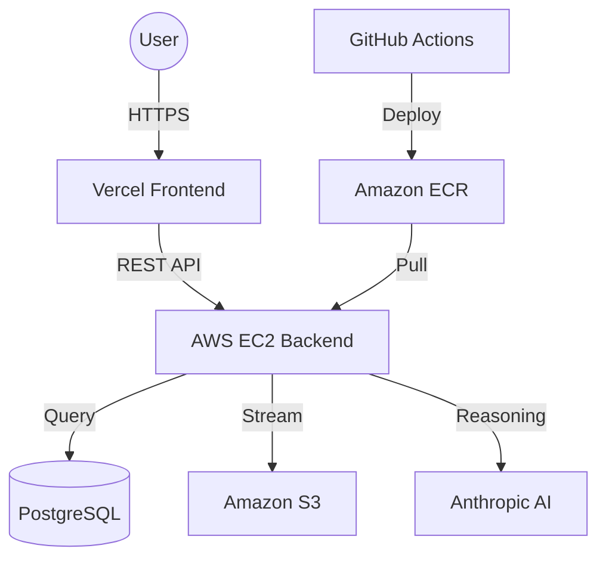

# 🛢️ LAS Analyzer: Engineering-Grade Well Log Intelligence

> **Transforming raw subsurface data into actionable geological insights.** LAS Analyzer is a full-stack platform designed to bridge the gap between complex petrophysical data and modern AI reasoning.

---

## � Live ecosystem
*   **🌐 Production App**: [las-analyzer.vercel.app](https://las-analyzer.vercel.app)
*   **📡 System API**: [http://13.201.9.95/api](http://13.201.9.95/api)
*   **🩺 Health Status**: [http://13.201.9.95/health](http://13.201.9.95/health)

---

## 🏁 How to Start
If you are an evaluator or developer looking to run this locally, please jump to our dedicated guide:
👉 **[Run Literally Anywhere: Local Setup Guide](./run_locally.md)**

---

## 🔥 Key Innovations

### 🔍 1. Smart LAS Ingestion Engine
Unlike simple CSV parsers, our engine is built specifically for the **Log ASCII Standard (LAS)**.
- **Header Intelligence**: Automatically extracts metadata like `WELL`, `FIELD`, `API Number`, and `Company`.
- **Curve Profiling**: Pre-calculates `min`, `max`, and `mean` values for every curve upon upload, allowing for instant AI context without re-processing massive files.
- **Hybrid Storage**: Combines the durability of **Amazon S3** (for raw file preservation) with the speed of **PostgreSQL** (for structured data access).

### 📊 2. Interactive Petrophysical Visualizer
Visualization is the heart of geological analysis.
- **Track-Based Viewing**: Render multiple curves (Gamma Ray, Resistivity, Porosity) on a synchronized depth axis.
- **Real-Time Filtering**: Isolate specific depth intervals (e.g., target pay zones) with sub-second responsiveness.
- **UX Excellence**: A premium, "Glassmorphism" inspired dashboard built with **Tailwind CSS** and **Plotly.js**.

### 🧠 3. Context-Aware AI Interpretation (The "Brain")
We don't just "chat" with your data; we interpret it.
- **Geologic Mapping**: Automatically identifies lithology trends and identifies potential fluid contacts.
- **Floating AI Assistant**: A specialized chatbot that maintains a **Persistent State**. It "sees" what you are looking at—knowing the exact curves, ranges, and well metadata.
- **Claude 3.5 Sonnet**: Powered by the most sophisticated reasoning model available to ensure petrophysical accuracy.

---

## 🏗️ Technical Blueprint

### The Architecture
The platform utilizes a **Decoupled Service Architecture** designed for high availability and clean separation of concerns.

### Tech Stack Breakdown
| Component | Choice | Why? |
| :--- | :--- | :--- |
| **Frontend** | React 19 + Vite | Blazing fast HMR and modern rendering features. |
| **Styling** | Tailwind CSS | Rapid UI development with professional aesthetic. |
| **Backend** | Express.js | Industrial-standard, lightweight, and scalable. |
| **Database** | PostgreSQL | Handles complex relationships between Wells and Curves better than NoSQL. |
| **Registry** | Amazon ECR | Secure, private, and integrated perfectly with AWS EC2. |
| **Orchestration** | Docker Compose | Simple, reproducible environment management. |

---

## � Project Navigation
- `/frontend`: React application, UI components, and visualization logic.
- `/backend`: Express API, LAS parsing engine, and AI service logic.
- `/docker-compose.yml`: Local and production orchestration.
- `/.github/workflows`: The "Engine Room" (CI/CD pipelines).
- `DEPLOYMENT.md`: Infrastructure setup for AWS/GitHub.
- `run_locally.md`: Developer onboarding.

---

## 🚀 Advanced DevOps Strategy
This project implements a professional **Continuous Deployment** strategy:
1.  **Build**: GitHub Actions builds a Production Docker image on every push to `main`.
2.  **Verify**: Built-in linting and optional testing suites ensure code integrity.
3.  **Deploy**: Images are pushed to **AWS ECR**, and a secure "remote-exec" script updates the EC2 instance instantly.
4.  **Secrets**: 100% of sensitive configuration is managed via GitHub Secrets—zero leakage in the codebase.

---

---

## �️ Demo Video
*[Placeholder: Add your video link here!]*

---

## ✅ Submission Checklist (Deliverables)

- [x] **Architecture**: Decoupled Frontend/Backend with secure API communication.
- [x] **File Ingestion**: Automatic parsing and storage in **Amazon S3**.
- [x] **Visualization**: Interactive depth-indexed curves using Plotly.js.
- [x] **AI Interpretation**: Automated geologic insights using Anthropic Claude.
- [x] **Bonus**: Full Conversational Chatbot interface.
- [x] **Deployment**: Live on **AWS EC2** (Backend) and **Vercel** (Frontend).
- [x] **Documentation**: Detailed local and cloud guides provided.

---

## �👤 Project Status
**Author**: adldi07 (Engineering Assessment for One-Geo)
**Status**: 🟢 Production Ready

---
